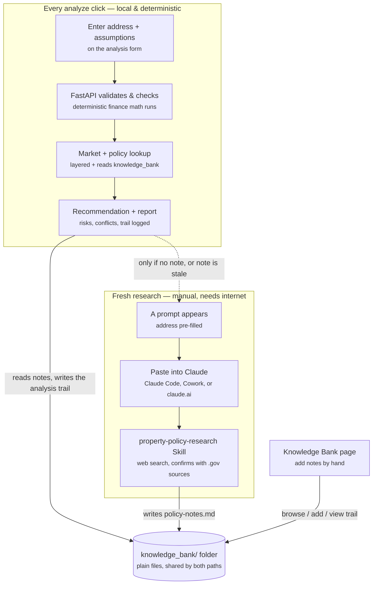

# NorthStar Property Investment Consulting

NorthStar is a local web app that helps an individual investor decide whether to buy a specific U.S. residential rental property. Enter an address and your investment assumptions, and it returns an investor report covering financial metrics, market context, local policy and rental restrictions, risks, opportunities, and a final recommendation: **Buy**, **Investigate Further**, or **Reject**.

The app runs entirely on your machine and uses no paid APIs, no scraping, and no live data at analysis time. Market and policy samples live in local JSON; local rules you have researched live in the `knowledge_bank/` folder. Live research happens outside the app through the `property-policy-research` agent Skill, which keeps the app itself deterministic and reliable offline.

> Design Studio Project | BUKD-X500: Agentic AI Systems | Kelley School of Business
> Team 5: Ashish Nath, Justin Kretschman
> Proposal: [Week9_DSP_NorthStar_Property_Investment_Consulting_Proposal.docx](Week9_DSP_NorthStar_Property_Investment_Consulting_Proposal.docx)

---

## How it all fits together

Two connected flows share one folder. The blue path runs every time you click Analyze — always local, always deterministic. The amber path is manual and only needed when you want fresh, live-researched policy facts.



**Why the Skill can't just run automatically:** it needs an LLM agent loop with live web search — a fundamentally different runtime than this deterministic FastAPI process, and running it silently would break the proposal's "no paid APIs, fully offline" MVP commitment. What the app *can* do, and does: it already has your address, so it hands you a ready-to-paste command instead of making you type one. See [When there is no note yet](#when-there-is-no-note-yet-the-research-request-panel) below.

---

## Quick start

Double-click **`Run_NorthStar.bat`**. It creates `.venv` if needed, installs requirements, runs the tests, stops any old NorthStar server still holding port 8000, opens your browser, and starts the app at `http://127.0.0.1:8000`.

Or set it up by hand:

```powershell
python -m venv .venv
.\.venv\Scripts\Activate.ps1
python -m pip install --upgrade pip
python -m pip install -r requirements.txt
uvicorn app.main:app --reload
```

Two pages:

| Page | What it is for |
|---|---|
| `http://localhost:8000` | Analyze a property and read the investor report |
| `http://localhost:8000/knowledge-bank` | Browse policy notes, add your own, inspect the analysis trail |

**If a change does not appear**, an old server process is probably still running. A running Python process keeps the code and data it loaded at startup. The launcher now clears port 8000 for you; to do it by hand:

```powershell
Get-NetTCPConnection -LocalPort 8000 -State Listen | ForEach-Object { Stop-Process -Id $_.OwningProcess -Force }
```

**To free up disk space**, double-click **`Clean_NorthStar.bat`**. It removes only what NorthStar regenerates automatically — `app\__pycache__`, `tests\__pycache__`, `.pytest_cache`, and the analysis trail logs (`knowledge_bank\**\_analysis-log.md`) — and asks for confirmation before deleting anything. It never touches your policy notes, PDFs, code, or anything under `knowledge_bank\researched\` or `knowledge_bank\user\`.

It also offers, as a separate confirmed step, to remove `.venv` (usually the single largest folder in the project). **Close any other terminal, editor, or running NorthStar server first** — if a file inside `.venv` is open elsewhere, Windows can only partially delete the folder, which would otherwise leave a broken environment behind. If that happens anyway, `Run_NorthStar.bat` now detects a broken `.venv` (missing `pyvenv.cfg`) and rebuilds it automatically the next time you run it — you never need to fix this by hand.

---

## What the report contains

**Financial metrics**, all from a deterministic, unit-tested Python model — never from an LLM:

Net Operating Income (NOI), monthly and annual cash flow, break-even rent, Debt Service Coverage Ratio (DSCR), going-in cap rate, Cash-on-Cash return, Loan-to-Value (LTV), 5-year and 10-year IRR, equity multiple, final-year NOI, exit cap rate, loan balance, sales costs, total cash returned, and net sale proceeds. Growth and inflation assumptions are shown separately so the deal can be stress-tested.

**Policy and risk sections**, drawn from the sample records and your knowledge bank:

- **Policy Restrictions and Sources** — flags and official source links grouped by jurisdiction (city/county, state, HOA/private)
- **Assumptions the Local Rules Do Not Support** — assumptions that exceed a limit recorded in a policy note
- **Diligence Checklist** — open questions the notes say must be confirmed before closing
- **Risks and Opportunities**, missing-data flags, and the final recommendation with its reasons

---

## Architecture

| File | Role |
|---|---|
| `app/main.py` | FastAPI app, page routes, and the JSON API |
| `app/schemas.py` | Pydantic request validation |
| `app/finance.py` | Deterministic financial model and recommendation rules |
| `app/data_loader.py` | Local JSON loading, jurisdiction layering, address checks, knowledge-bank discovery |
| `app/knowledge_bank.py` | Scanning, parsing, rendering, and writing knowledge-bank notes |
| `app/analysis.py` | Assembles the report: finance, market, policy, conflicts, risks, recommendation |
| `data/` | Sample market, policy, and property records, plus `zip_directory.json` for address checks |
| `knowledge_bank/` | Your local policy library — see [its README](knowledge_bank/README.md) |
| `templates/`, `static/` | Analysis dashboard and Knowledge Bank pages |
| `.claude/skills/property-policy-research/` | The research Skill bundled with the project |
| `tests/` | 80 tests across 6 files |
| `agentic.md` | AI project memory for future work sessions |

### Data flow

1. The browser form collects the property and assumptions and posts to `POST /api/analyze`.
2. Pydantic validates the request, so bad input is caught before any analysis runs.
3. `check_location_consistency` confirms the city, state, and ZIP describe the same place. This also runs live on the form while you type, via `POST /api/location-check`.
4. `finance.py` computes every metric deterministically.
5. `data_loader.py` loads market data by ZIP with state and national fallback, and builds a **layered** policy context — city/county, state, and national records are merged so the report shows every jurisdiction that applies, each tagged with its source.
6. `data_loader.py` reads every `knowledge_bank/` folder that matches the property, parsing flags, machine-readable limits, and diligence items out of the notes.
7. `analysis.py` assembles the report, including conflicts between your assumptions and the limits the notes record.
8. `record_analysis` appends what was used to that ZIP's analysis trail.
9. The frontend renders the dashboard.

### API

| Endpoint | Purpose |
|---|---|
| `GET /` , `GET /knowledge-bank` | The two pages |
| `POST /api/analyze` | Run an analysis and return the report |
| `POST /api/location-check` | Check city/state/ZIP agreement while the form is being filled |
| `GET /api/sample-properties` | Sample scenarios for the "Load sample" menu |
| `GET /api/knowledge-bank` | Inventory of every note and trail file |
| `GET /api/knowledge-bank/note?path=` | One note, rendered as HTML |
| `GET /api/knowledge-bank/trace?path=` | One analysis trail |
| `POST /api/knowledge-bank/notes` | Save a note the user wrote |
| `GET /api/health` | Health check |

---

## The knowledge bank

### The Skill versus the folder

These are two different things:

- **`property-policy-research`** (in `.claude/skills/`) is a **Skill** — instructions an AI agent follows. It researches rental rules on the live web and **writes** notes. You run it in Claude Code, Cowork, or claude.ai.
- **`knowledge_bank/`** is a **folder of files**. The app **reads** it and never writes policy into it.

**The Skill writes; the app reads.** The app never goes online — it reads whatever files are in the folder when you click Analyze.

### Two roots: `researched/` vs. `user/`

So a fact can always be told apart from something typed in, the folder is split into two roots holding the identical taxonomy:

- **`knowledge_bank/researched/`** — written only by the Skill, after live web search verified against official sources. The app's own write path refuses to write here.
- **`knowledge_bank/user/`** — written by you, through the form or by hand.

A property reads both roots at every specificity tier, and every note the app shows is tagged with which root it came from.

### Three ways notes get in

1. **The research Skill** — ask Claude *"Run policy diligence on 250 5th Ave, Brooklyn, NY 11215"* and it researches the rules, verifies them against official `.gov` sources, and writes a dated, cited note into `researched/`.
2. **The Knowledge Bank page** — use the "Add a local policy note" form, choose where it applies, paste your text, save; this always lands in `user/`.
3. **By hand** — drop a `.md` or `.txt` file into the right `user/` folder.

### Folder layout

Within each root, folders run broad to specific, and a property picks up every matching folder in both roots:

```text
knowledge_bank/
├── researched/                          written only by the Skill
│   └── zips/11215/policy-notes.md
└── user/                                written by you
    ├── global/                          every property
    ├── states/NY/                       any property in New York
    ├── zips/11215/                      that ZIP
    ├── cities/brooklyn_ny/              that city
    └── properties/250_5th_ave_11215/    one specific address
```

Folders are created on demand, so only ones holding a note exist. Older flat `<state>-<zip>/` folders (from before this split existed) are still read, tagged as a legacy source.

### The Knowledge Bank page

`http://localhost:8000/knowledge-bank` scans the folder at request time, so anything added appears immediately. Each note shows where it applies, when it was researched, its flag counts by severity, how many citations are official versus secondary, and how many diligence items it raises. Notes older than 120 days are marked stale. Clicking through renders the note as HTML, so official source links are clickable.

### What makes a note do more than display

Any note is shown in the report. Two optional sections give it teeth.

**A high-attention flags table** — rows appear in Policy Restrictions and Sources, and every HIGH row becomes a risk that can change the recommendation:

```markdown
## 5. High-Attention Flags (summary for NorthStar report)

| Flag | Severity | Why |
|---|---|---|
| HOA rental cap may be full | HIGH | The unit may not be rentable this year |
```

**A machine-readable summary** — these values are checked against your own assumptions, so a note can correct the financial model:

```markdown
## NorthStar Machine-Readable Summary

- rent_growth_cap_percent: 0
- short_term_rental_allowed: false
```

Analyze the Brooklyn sample with 3% rent growth and the report opens with a red panel: the Rent Guidelines Board froze stabilized leases at 0%, so the IRR and equity multiple below assume growth the law does not permit. This is the knowledge bank reaching into the deterministic model rather than sitting beside it as commentary.

Notes are also scanned for "unverified / confirm with / obtain" lines, which become the report's **Diligence Checklist**.

### When there is no note yet: the research request panel

The app already has the address you entered — it should not make you retype it into a separate chat. When a property has no matching note, or its only note is older than 120 days, the report shows a panel with a ready-to-paste command, your exact address already filled in:

> Run policy diligence on 250 5th Ave, Brooklyn, NY 11215.

Click **Copy**, paste it into a Claude Code, Cowork, or claude.ai chat with web search enabled, and the Skill researches that address and writes a note back into `knowledge_bank/`. The next time you analyze that property, the app picks the note up automatically. When a fresh note already exists, this panel does not appear.

### Bundled researched notes

Three notes produced by the Skill ship with the project:

| Note | Market | Why it is interesting |
|---|---|---|
| `researched/zips/78704/policy-notes.md` | Austin, TX | STR legal with a license; no rent control statewide |
| `researched/zips/90026/policy-notes.md` | Los Angeles, CA | STR effectively banned for investors; two overlapping rent-control regimes |
| `researched/zips/11215/policy-notes.md` | Brooklyn, NY | STR blocked by Local Law 18; rent freeze for stabilized units |

Los Angeles and Brooklyn have no built-in sample policy record, so those reports are driven entirely by the researched notes — the knowledge bank doing exactly the job the proposal describes.

### Traceability: the analysis trail

Every analysis appends a record to `knowledge_bank/zips/<ZIP>/_analysis-log.md` — the address, the recommendation, which market and policy records matched, which notes were read, the address check, the flags applied, and any assumption conflicts. Open a ZIP's folder months later and you can see exactly what produced a past recommendation. Trails also appear in their own section on the Knowledge Bank page.

Files beginning with `_` are written by the app and are **never read back into a report**, so a trail can never feed the analysis its own output. Trails are git-ignored: they are your run history, not project source.

### The research Skill in detail

Given an address, the Skill web-searches short-term rental permit rules, state landlord–tenant law, rent control status, and HOA rental restrictions; verifies findings against official `.gov` sources; and writes a note to `knowledge_bank/researched/zips/<zip>/policy-notes.md`. Every fact carries a source link, an "as of" date, and an official-versus-secondary tag. When an official source and a third-party guide disagree, the official source wins. It never writes into `knowledge_bank/user/`, which is reserved for notes a person adds.

It runs outside the app, in any agent with web search and file access. See [the Skill's README](.claude/skills/property-policy-research/README.md) for setup on Claude Code, Cowork, claude.ai, and Codex.

---

## Address consistency checking

Because market and policy lookups key off the ZIP, a typo would otherwise produce a confident report for the wrong place. NorthStar checks all three address fields against `data/zip_directory.json`:

- **State versus ZIP** — a ZIP-prefix table covering the mainland U.S., so this works even for ZIPs not in the sample data
- **City versus ZIP** — checked against a built-in place directory; "Saint" and "St." are treated as the same word
- **Malformed ZIPs** — anything that is not five digits

A mismatch appears under the property fields as you type, again as a banner above the recommendation, and as a high-severity risk that counts against a confident result. Checks that cannot be made are reported as *unverified* rather than quietly passing.

---

## Demo suggestions

Use the **Load sample** menu:

| Sample | What it shows |
|---|---|
| Indianapolis | A stronger deal; city and state policy records layered together |
| St. Louis | Older-home diligence case |
| Austin | High price with policy risk; researched note merges with built-in records |
| Los Angeles | Report driven entirely by a researched note; STR ban and RSO rent cap |
| Brooklyn | Rent-freeze conflict — raise rent growth above 0% to trigger the guardrail |

You can also type any address. If the ZIP is not in the sample data, NorthStar falls back to state or national records and says so plainly.

---

## Testing

```powershell
pytest
```

80 tests across six files: the financial model and recommendation rules, jurisdiction layering and address checks, note parsing and rendering, note writing (including path-traversal and overwrite cases), the analysis trail, and the API endpoints.

---

## Future extensions

- Host the app so it is reachable online instead of locally
- Upload of source documents (PDF HOA declarations, leases, inspection reports) with AI-assisted document Q&A — the current form accepts pasted text notes
- Live public-data retrieval for market rents, property taxes, and zoning through paid APIs
- Scenario comparison for best/base/worst cases and sensitivity analysis
- Multi-property comparison to rank candidates side by side

---

## Responsible use

NorthStar is a decision-support tool, not licensed legal, tax, financial, or investment advice. Sample market and policy data must be verified before any real purchase decision. Notes produced by the research Skill separate officially verified facts from secondary sources — anything tagged secondary should be confirmed with the issuing authority before you rely on it.
