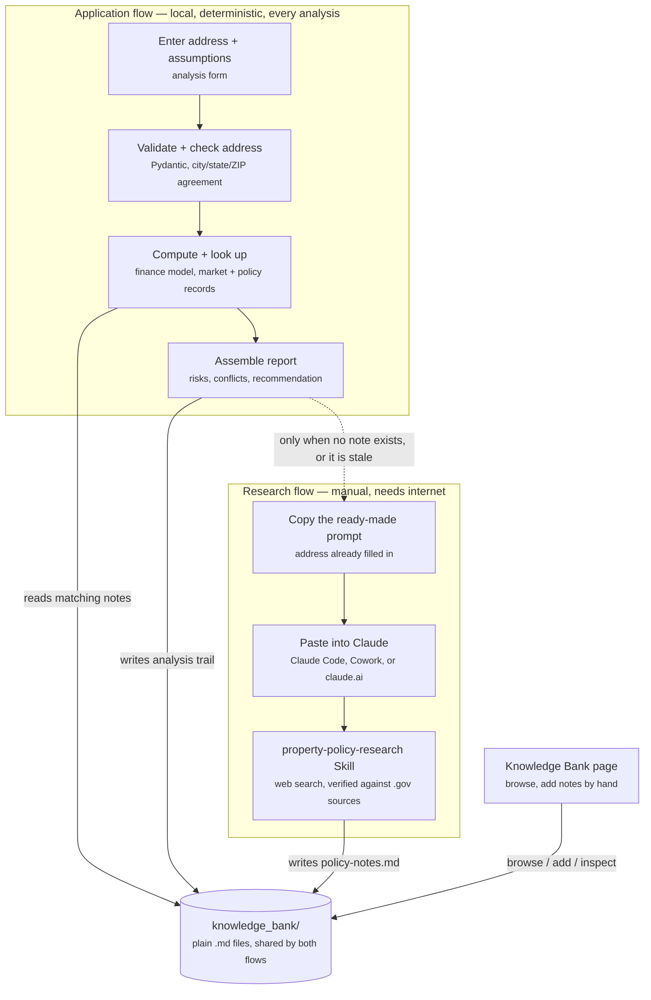

# NorthStar Property Investment Consulting

NorthStar is a local web application that helps an individual investor decide whether to buy a specific U.S. residential rental property. Enter an address and your investment assumptions, and it returns an investor-style report covering financial metrics, market context, local policy and rental restrictions, risks, opportunities, and a final recommendation: **Buy**, **Investigate Further**, or **Reject**.

The application runs entirely on your machine. It uses no paid APIs, no scraping, and no network calls at analysis time — every number comes from a deterministic, unit-tested Python model, and every policy finding comes from local files you can open and read. Live regulatory research happens *outside* the app, through a reusable AI agent Skill that writes its findings into a folder the app reads.

> **Design Studio Project** | BUKD-X500: Agentic AI Systems | Kelley School of Business
> **Team 5:** Ashish Nath, Justin Kretschman
> **Proposal:** [docs/Week9_DSP_NorthStar_Property_Investment_Consulting_Proposal.docx](docs/Week9_DSP_NorthStar_Property_Investment_Consulting_Proposal.docx)

---

## Contents

- [Quick start](#quick-start)
- [How it works](#how-it-works)
- [Project structure](#project-structure)
- [Architecture](#architecture)
- [The knowledge bank](#the-knowledge-bank)
- [Address consistency checking](#address-consistency-checking)
- [Demo guide](#demo-guide)
- [Testing](#testing)
- [Maintenance](#maintenance)
- [Future extensions](#future-extensions)
- [Responsible use](#responsible-use)

---

## Quick start

Double-click **`Run_NorthStar.bat`**. It creates the virtual environment if needed, installs requirements, runs the test suite, clears any stale server off port 8000, opens your browser, and starts the app.

Or set it up by hand:

```powershell
python -m venv .venv
.\.venv\Scripts\Activate.ps1
python -m pip install --upgrade pip
python -m pip install -r requirements.txt
uvicorn app.main:app --reload
```

The app serves two pages:

| Page | Purpose |
|---|---|
| `http://localhost:8000` | Analyze a property and read the investor report |
| `http://localhost:8000/knowledge-bank` | Browse policy notes, add your own, inspect the analysis trail |

**Requirements:** Python 3.11+ and Windows (the `.bat` launchers are Windows-specific; the app itself is cross-platform).

> **If a code change doesn't appear in the browser,** a stale server process is almost always the cause — a running Python process keeps the code *and* JSON data it loaded at startup. `Run_NorthStar.bat` clears port 8000 automatically. To do it manually:
>
> ```powershell
> Get-NetTCPConnection -LocalPort 8000 -State Listen | ForEach-Object { Stop-Process -Id $_.OwningProcess -Force }
> ```

---

## How it works

Two connected flows share one folder. The **application flow** runs every time you click Analyze — always local, always deterministic. The **research flow** is manual and only needed when you want fresh, live-researched policy facts for an address.



**Why the Skill isn't called automatically:** it needs an LLM agent loop with live web search — a fundamentally different runtime than this deterministic FastAPI process. Wiring it in would also break the project's founding constraint of no paid APIs and full offline reliability. What the app *does* do is remove the busywork: it already knows your address, so it hands you a ready-to-paste command instead of making you retype one.

---

## Project structure

Source, tests, data, docs, and tooling each have one obvious home. The two launchers stay at the root on purpose — they are the user-facing entry points, and the project's deliverable is explicitly a file you double-click.

```text
NorthStar Property Investment Consulting/
│
├── app/                          ── APPLICATION SOURCE ──────────────────
│   ├── main.py                   FastAPI app: routes and the JSON API
│   ├── schemas.py                Pydantic request validation
│   ├── finance.py                Deterministic financial model
│   ├── data_loader.py            JSON loading, policy layering, address checks
│   ├── knowledge_bank.py         Note parsing, rendering, writing, analysis trail
│   ├── analysis.py               Report assembly, risks, assumption conflicts
│   ├── templates/                Jinja2 pages served by the app
│   │   ├── index.html            Analysis dashboard
│   │   └── knowledge_bank.html   Knowledge Bank browser
│   └── static/                   Frontend assets (no build step)
│       ├── app.js                Form handling and report rendering
│       ├── knowledge_bank.js     Knowledge Bank page behavior
│       └── styles.css            Dashboard styling
│
├── tests/                        ── TEST SUITE ──────────────────────────
│   └── (6 files, 90 tests)       Mirrors the app modules; see Testing below
│
├── data/                         ── BUNDLED REFERENCE DATA ──────────────
│   ├── market_data.json          Rent/value/tax context by ZIP, state, national
│   ├── policy_data.json          Rental rules and source links by jurisdiction
│   ├── sample_properties.json    Five demo scenarios for the "Load sample" menu
│   └── zip_directory.json        ZIP-to-place directory + ZIP-prefix-to-state table
│
├── knowledge_bank/               ── YOUR LOCAL POLICY LIBRARY ───────────
│   ├── researched/               Written only by the AI research Skill
│   ├── user/                     Written by you, via the app or by hand
│   └── README.md                 How the two roots work
│
├── docs/                         ── PROJECT DOCUMENTATION ───────────────
│   ├── Project_Prompt.md         The original build specification
│   └── Week9_..._Proposal.docx   Design Studio proposal
│
├── .claude/                      ── AGENT TOOLING ───────────────────────
│   ├── skills/                   The bundled property-policy-research Skill
│   └── launch.json               Dev-server config for agent tooling
│
├── Run_NorthStar.bat             ── ENTRY POINTS & CONFIG ───────────────
├── Clean_NorthStar.bat           One-click cleanup of generated files
├── requirements.txt              Python dependencies
├── README.md                     This file
├── AGENTS.md                     Spec for how agentic.md must be maintained
├── agentic.md                    AI project memory for future work sessions
└── .gitignore
```

**Why some files stay at the root.** `AGENTS.md` and `agentic.md` are read automatically by AI coding tools, which look for them at the project root — and `AGENTS.md` itself specifies that `agentic.md` must be root-level, so moving either would break the convention that makes them work. `README.md` stays at the root because that is where GitHub renders it.

---

## Architecture

**Stack:** Python FastAPI backend, vanilla HTML/CSS/JavaScript frontend, local JSON storage. No build step, no database, no external services.

### Modules

| Module | Responsibility |
|---|---|
| `app/main.py` | FastAPI app, page routes, JSON API, static-asset cache-busting |
| `app/schemas.py` | Pydantic models validating every request before analysis runs |
| `app/finance.py` | Pure functions for all financial math and the recommendation rules |
| `app/data_loader.py` | Loads market/policy JSON, layers jurisdictions, checks addresses, discovers knowledge-bank notes |
| `app/knowledge_bank.py` | Parses, renders, scans, and writes policy notes; writes the analysis trail |
| `app/analysis.py` | Combines everything into the final report structure |

### Data flow

1. The browser form collects the property and assumptions, then posts to `POST /api/analyze`.
2. **Pydantic validates** the request, so malformed input is rejected before any analysis runs.
3. **`check_location_consistency`** confirms the city, state, and ZIP describe the same place. This also runs live on the form as you type, via `POST /api/location-check`.
4. **`finance.py`** computes every metric deterministically — never an LLM.
5. **`data_loader.py`** loads market data by ZIP with state and national fallback, and builds a *layered* policy context: city/county, state, and national records are merged so the report shows every jurisdiction that applies, each tagged with its source.
6. **`data_loader.py`** then reads every `knowledge_bank/` folder matching the property, extracting high-attention flags, machine-readable limits, and diligence items from the notes.
7. **`analysis.py`** assembles the report, including any conflicts between your assumptions and limits recorded in the notes.
8. **`record_analysis`** appends what was actually used to that ZIP's analysis trail.
9. The frontend renders the dashboard.

### API

| Method | Endpoint | Purpose |
|---|---|---|
| `GET` | `/` | Analysis dashboard |
| `GET` | `/knowledge-bank` | Knowledge Bank browser |
| `POST` | `/api/analyze` | Run an analysis, return the full report |
| `POST` | `/api/location-check` | Check city/state/ZIP agreement while the form is being filled |
| `GET` | `/api/sample-properties` | Demo scenarios for the "Load sample" menu |
| `GET` | `/api/knowledge-bank` | Inventory of every note and trail file |
| `GET` | `/api/knowledge-bank/note?path=` | One note, rendered as HTML |
| `GET` | `/api/knowledge-bank/trace?path=` | One analysis trail |
| `POST` | `/api/knowledge-bank/notes` | Save a note the user wrote |
| `GET` | `/api/health` | Health check |

### What the report contains

**Financial metrics** — all deterministic and unit-tested:

Net Operating Income (NOI), monthly and annual cash flow, break-even rent, Debt Service Coverage Ratio (DSCR), going-in cap rate, Cash-on-Cash return, Loan-to-Value (LTV), 5- and 10-year IRR, equity multiple, final-year NOI, exit cap rate, remaining loan balance, sales costs, total cash returned, and net sale proceeds. Growth and inflation assumptions are surfaced separately so the deal can be stress-tested.

**Policy and risk sections** — drawn from the sample records and your knowledge bank:

- **Policy Restrictions and Sources** — flags and official source links, grouped by jurisdiction (city/county, state, HOA/private)
- **Assumptions the Local Rules Do Not Support** — assumptions that exceed a limit recorded in a policy note
- **Diligence Checklist** — open questions the notes say must be confirmed before closing
- **Risks and Opportunities**, missing-data flags, and the final recommendation with its supporting reasons

---

## The knowledge bank

This is what separates NorthStar from a spreadsheet: local rules that actually reach into the financial model.

### The Skill versus the folder

Two different things, easy to confuse:

| | `property-policy-research` | `knowledge_bank/` |
|---|---|---|
| What it is | A **Skill** — instructions an AI agent follows | A **folder of files** |
| Where it lives | `.claude/skills/property-policy-research/` | Project root |
| What it does | Researches rental rules on the live web and **writes** notes | **Stores** notes for the app to read |
| Who runs it | You, in Claude Code / Cowork / claude.ai | Nobody — the app just reads it |
| Needs internet | Yes | No |

**The Skill writes; the app reads.** The app never goes online — it reads whatever files sit in the folder at the moment you click Analyze.

### Two roots: `researched/` and `user/`

The folder is split so a verified fact can always be told apart from something typed in:

- **`knowledge_bank/researched/`** — written *only* by the Skill, after live web search verified against official sources. The app's own write path refuses to write here, and `create_note` rejects the path even if called directly, so a note's presence here is a genuine trust signal.
- **`knowledge_bank/user/`** — written by you, through the in-app form or by dropping a file in.

Both roots hold the same taxonomy and are searched at every specificity tier, so a more specific folder always outranks a broader one regardless of which root it lives in. Every note the app surfaces is tagged with its origin: **AI-researched**, **Added by you**, or **Legacy folder**.

### Folder layout

```text
knowledge_bank/
├── researched/                          written only by the Skill
│   └── zips/11215/policy-notes.md
├── user/                                written by you
│   ├── global/                          applies to every property
│   ├── states/NY/                       any property in New York
│   ├── zips/11215/                      that ZIP
│   ├── cities/brooklyn_ny/              that city
│   └── properties/250_5th_ave_11215/    one specific address
└── zips/<ZIP>/_analysis-log.md          app-written trail (see below)
```

Folders are created on demand, so only ones holding a note exist. Legacy flat `<state>-<zip>/` folders from an earlier layout are still read and tagged as such.

### Three ways notes get in

1. **The research Skill** — ask Claude *"Run policy diligence on 250 5th Ave, Brooklyn, NY 11215"*. It researches the rules, verifies them against official `.gov` sources, and writes a dated, cited note into `researched/`.
2. **The Knowledge Bank page** — use the "Add a local policy note" form, choose where it applies, paste your text, and save. This always lands in `user/`.
3. **By hand** — drop a `.md` or `.txt` file into the appropriate `user/` folder.

### What makes a note do more than display

Any note appears in the report. Two optional sections give it real influence.

**A high-attention flags table** — rows appear in Policy Restrictions and Sources, and every `HIGH` row becomes a risk that can change the recommendation:

```markdown
## 5. High-Attention Flags (summary for NorthStar report)

| Flag | Severity | Why |
|---|---|---|
| HOA rental cap may be full | HIGH | The unit may not be rentable this year |
```

**A machine-readable summary** — these values are checked against your own assumptions, so a note can correct the financial model:

```markdown
## NorthStar Machine-Readable Summary

- rent_growth_cap_percent: 0
- short_term_rental_allowed: false
- security_deposit_cap_months: 1
```

Analyze the Brooklyn sample with 3% rent growth and the report opens with a red panel: New York's Rent Guidelines Board froze stabilized leases at 0%, so the IRR and equity multiple below assume growth the law does not permit. Use `none` when a limit doesn't apply.

Notes are also scanned for lines containing "unverified", "confirm with", or "obtain", which become the report's **Diligence Checklist**. A note whose `**Researched:**` date is older than 120 days is flagged as stale.

### The Knowledge Bank page

`http://localhost:8000/knowledge-bank` scans the folder on every request, so anything added appears immediately. Each note shows its scope, research date and staleness, flag counts by severity, official-versus-secondary citation counts, and diligence count. Clicking through renders the note as HTML so official source links are clickable.

### When no note exists yet

The app already has the address you entered, so it doesn't make you retype it. When a property has no matching note — or its only note is stale — the report shows a ready-to-paste command with your exact address filled in:

> Run policy diligence on 250 5th Ave, Brooklyn, NY 11215.

Click **Copy**, paste it into a Claude chat with web search enabled, and the Skill writes a note back into `knowledge_bank/researched/`. Your next analysis of that property picks it up automatically. When a fresh note already exists, this panel doesn't appear.

### Bundled researched notes

Three notes produced by the Skill ship with the project, chosen because they are near-opposite regulatory environments:

| Note | Market | Why it's instructive |
|---|---|---|
| `researched/zips/78704/policy-notes.md` | Austin, TX | STR legal with a license; rent control banned statewide |
| `researched/zips/90026/policy-notes.md` | Los Angeles, CA | STR effectively banned for investors; two overlapping rent-control regimes |
| `researched/zips/11215/policy-notes.md` | Brooklyn, NY | STR blocked by Local Law 18; rent freeze on stabilized units |

Los Angeles and Brooklyn have no built-in sample policy record at all, so those reports are driven *entirely* by researched notes — the knowledge bank doing exactly the job the proposal describes.

### Traceability: the analysis trail

Every analysis appends a record to **`knowledge_bank/zips/<ZIP>/_analysis-log.md`** capturing the address, the recommendation, which market and policy records matched, which notes were read, the address-check result, the flags applied, and any assumption conflicts. Months later you can open a ZIP's folder and see exactly what produced a past recommendation. Trails also appear in their own section on the Knowledge Bank page.

Two deliberate properties:

- The trail is written **outside** the `researched/` and `user/` roots, because it is a record of what the app did — not a policy input.
- **Files beginning with `_` are never read back into a report**, so a trail can never feed the analysis its own past output. Trails are also git-ignored: they are your run history, not project source.

---

## Address consistency checking

Because market and policy lookups key off the ZIP code, a typo would otherwise produce a confident report for the wrong place. NorthStar validates all three address fields against `data/zip_directory.json`:

- **State versus ZIP** — a ZIP-prefix table covering the mainland U.S., so this works even for ZIPs absent from the sample data
- **City versus ZIP** — checked against a built-in place directory; "Saint" and "St." are treated as equivalent
- **Malformed ZIPs** — anything that isn't five digits

A mismatch surfaces in three places: under the property fields as you type, as a banner above the recommendation, and as a high-severity risk counting against a confident result. Checks that *cannot* be performed are reported as **unverified** rather than quietly passing — the tool never implies it confirmed something it didn't.

---

## Demo guide

Use the **Load sample** menu:

| Sample | What it demonstrates |
|---|---|
| Indianapolis | A stronger deal; city and state policy records layered together |
| St. Louis | Older-home diligence case with elevated maintenance assumptions |
| Austin | High price with policy risk; researched note merges with built-in records |
| Los Angeles | Report driven entirely by a researched note — STR ban and RSO rent cap |
| Brooklyn | Rent-freeze conflict — raise rent growth above 0% to trigger the guardrail |

You can also enter any address. If the ZIP isn't in the sample data, NorthStar falls back to state or national records and says so plainly rather than guessing.

---

## Testing

```powershell
pytest
```

**90 tests across 6 files:**

| File | Coverage |
|---|---|
| `test_finance.py` | Mortgage math, cash flow, cap rate, break-even rent, IRR, recommendation rules |
| `test_data_loader.py` | Jurisdiction layering, address consistency, knowledge-bank discovery |
| `test_knowledge_bank_module.py` | Note parsing, rendering, scanning, writing, path-traversal and overwrite guards |
| `test_knowledge_bank_notes.py` | Researched notes driving flags, risks, and the recommendation |
| `test_analysis_trail.py` | Trail writing, capping, and exclusion from note parsing |
| `test_api.py` | Endpoint behavior, assumption conflicts, research-request status |

`Run_NorthStar.bat` runs this suite on every launch and refuses to start the server if anything fails.

---

## Maintenance

Double-click **`Clean_NorthStar.bat`** to reclaim disk space. It removes only what the app regenerates automatically — `app\__pycache__`, `tests\__pycache__`, `.pytest_cache`, and analysis trail logs — and shows you a count before deleting anything. It never touches your policy notes, PDFs, source code, or anything under `knowledge_bank\researched\` or `knowledge_bank\user\`.

It separately offers to remove `.venv`, usually the largest folder in the project. **Close any other terminal, editor, or running server first** — if a file inside `.venv` is locked, Windows deletes only part of the folder and leaves a broken environment behind. If that happens, `Run_NorthStar.bat` detects the damage (a missing `pyvenv.cfg`) and rebuilds automatically on the next run, so you never need to repair it by hand.

---

## Future extensions

- Host the application so it is reachable online rather than locally
- Upload of source documents — PDF HOA declarations, leases, inspection reports — with AI-assisted document Q&A; the current form accepts pasted text notes
- Live public-data retrieval for market rents, property taxes, and zoning via paid APIs
- Scenario comparison across best/base/worst cases with sensitivity analysis
- Multi-property comparison to rank candidates side by side

---

## Responsible use

NorthStar is a decision-support tool, **not licensed legal, tax, financial, or investment advice.** The bundled market and policy data are illustrative samples, not verified public records, and must be confirmed before any real purchase decision.

Notes produced by the research Skill separate officially verified facts from secondary sources and date every claim. Anything tagged secondary — or any finding the note itself marks unverified — should be confirmed with the issuing authority or a qualified professional before you act on it.
